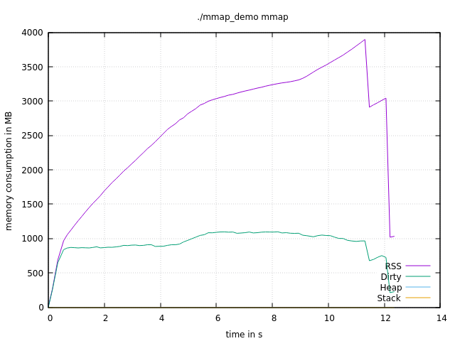

# mmap_demo

Small playground to show case mmap and its effect on memory consumption and runtime for a specific workload.

Build, then run either without args to run without mmapping, or pass 'mmap' as the first CLI arg to enable mmaping.

To measure time/RSS, use `/usr/bin/time -v`. For more detailed memory tracking, use `pmap` sampling e.g. via [1] and [2].

[1]: https://github.com/milianw/shell-helpers/blob/master/track_memory.sh
[2]: https://github.com/milianw/shell-helpers/blob/master/show_memory.sh

## no mmap

Heap equals RSS equals Dirty, all at 4GB after initial buffer allocation.

## mmap

RSS goes up to 4GB at the end, but only ~1GB is dirty at most, the rest apparently gets discarded early by the kernel. A bit faster too!
